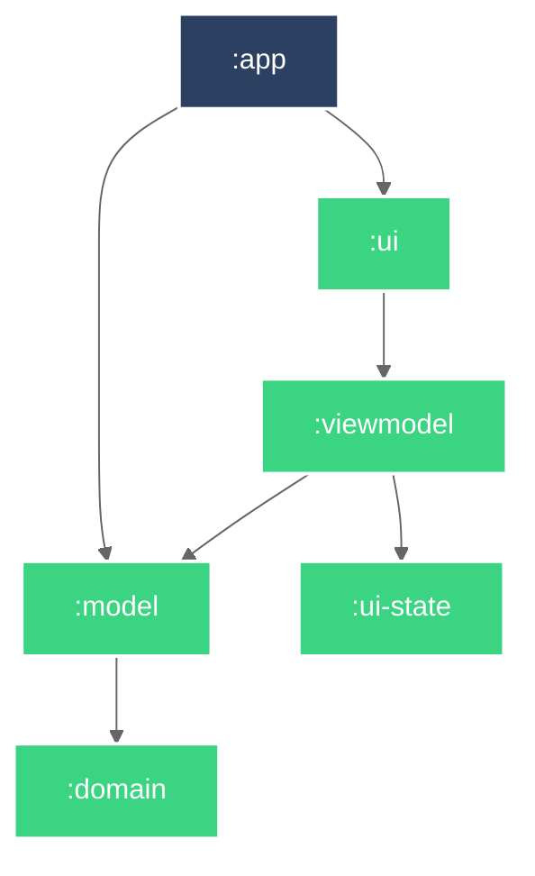

# Android 애플리케이션 템플릿

Android 애플리케이션 개발을 위한 템플릿 레포지토리.

## 개발 환경 설정

## Module Graph

## 문서

- [Architecture Decision Records](doc/adr/README.md)

## 참고

- https://github.com/iurysza/module-graph
- [.ignore](https://plugins.jetbrains.com/plugin/7495--ignore)